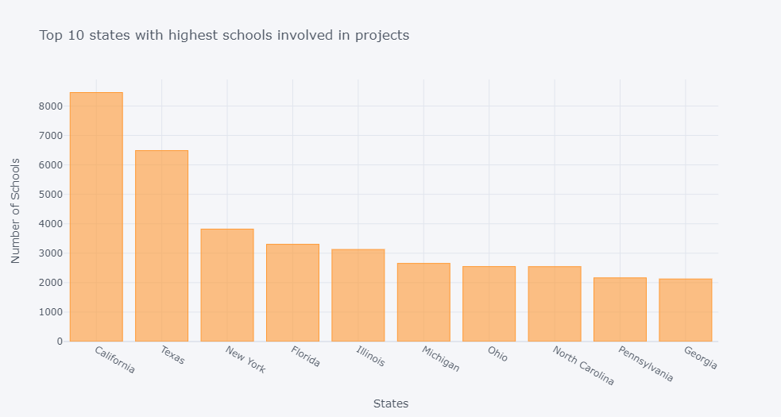
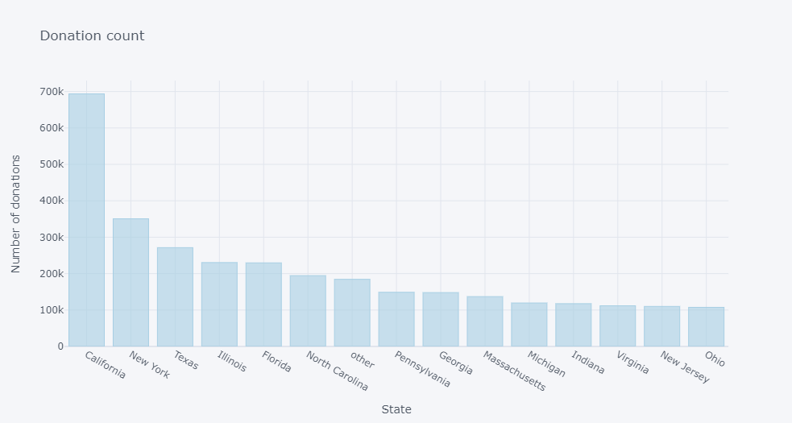
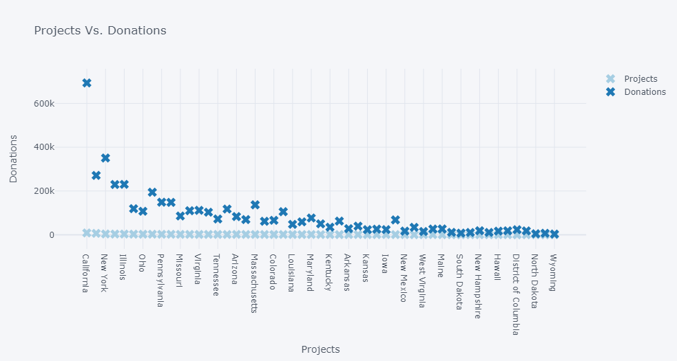
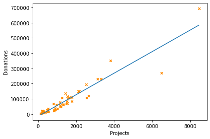
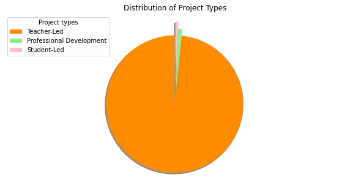
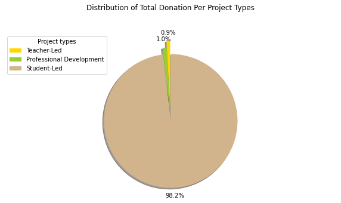
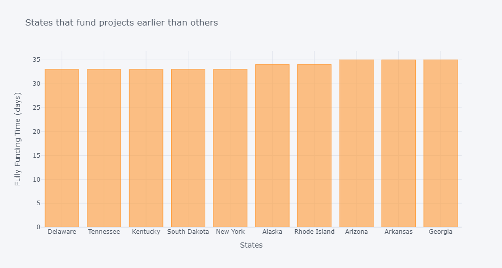

[](https://github.com/nduongthucanh)
[](https://github.com/nduongthucanh?tab=repositories)


[](https://forthebadge.com)
[](https://forthebadge.com)

# School Donation Analysis

## 🛈 Background Information

Founded in 2000 by a Bronx history teacher, [DonorsChoose.org](https://www.donorschoose.org) has raised $685 million for America's classrooms. Teachers at three-quarters of all the public schools in the U.S. have come to [DonorsChoose.org](https://www.donorschoose.org) to request what their students need, making [DonorsChoose.org](https://www.donorschoose.org) the leading platform for supporting public education.

To date, 3 million people and partners have funded 1.1 million [DonorsChoose.org](https://www.donorschoose.org) projects. But teachers still spend more than a billion dollars of their own money on classroom materials. To get students what they need to learn, the team at DonorsChoose.org needs to be able to connect donors with the projects that most inspire them.

## 🎯 Aim

The project aims to analyze complex data sets of **DonorsChoose** and provide recommendations to teacher about the top donors that may be willing to donate for a particular category. 

This is done through analysis of historical data and listing the top donors with most number of contributions as a donor as well as the most amount donated. 

To help teachers write proposal for their projects, bag of words using natural language processing is generated in Python after data pre-processing for this particular requirement. 

The project also provides success rate for each category based on the donation amount received and the proect requirement cost which will help teachers select the best category according to their need.

## 📁 Dataset

Public data set can be found here:: https://www.kaggle.com/hanselhansel/donorschoose

## 🛠️ Requirement


```python
!pip install chart_studio
!pip install matplotlib
```


## 📊 Data Visualization

* ### **Basic Analysis**

**Which 10 states have the most number of schools that opened projects to gather donations? Plot the data using bar plot.**




**In which states there are more donations done by donors.**


    
**Donation Vs. Project Relationship Scatter Plot**



**Fit a linear model which will basically indicate the relationship between projects and donations.**


**How mant different project types exists?**



**How mant project subject category trees exists and Which ones attracted the most donations?**



---

* ### **Time Series Analysis**

**What is the mean time that takes a project to be fully funded after posted and how it varies between states?**


**Which states are the best and which are the worst performing in terms of Average funding time (mean project fully funded time)**

- States that fund projects earlier than others:




- States that fund projects later than others:


## ✨ Contribution

Contributions, issues, and feature requests are welcome!

To contribute to Patronify, see the GitHub documentation on **[creating a pull request](https://help.github.com/en/github/collaborating-with-issues-and-pull-requests/creating-a-pull-request)**.

## 👏 Support

Give a ⭐️ if you like this project!
___________________________________

<p>&copy; 2021 Leah Nguyen</p>